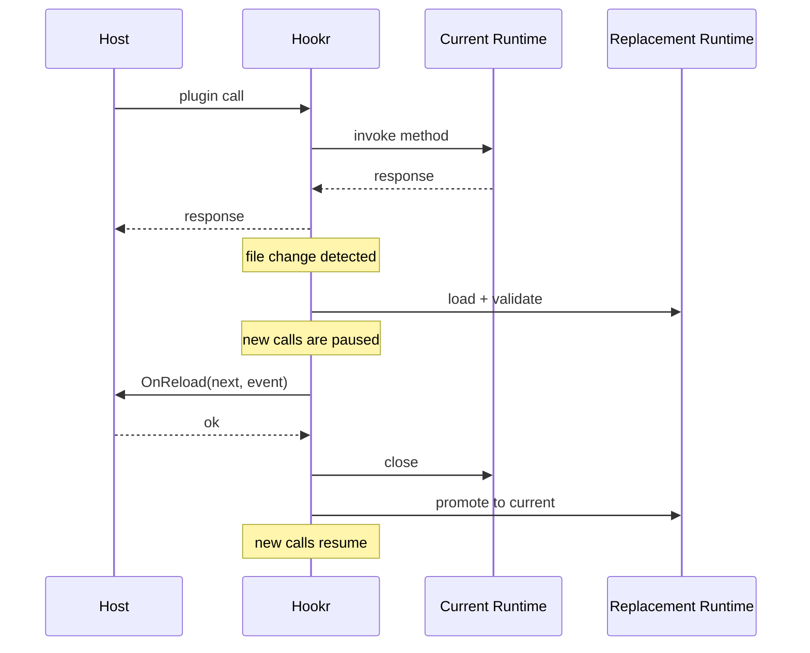

# Live Reload Lifecycle

Live reload exists so a host can keep one runtime handle while Hookr swaps the
underlying plugin instance when the plugin artifact changes.

This is mainly for development workflows, but the mechanics are designed to be
safe and predictable.

## Why Hookr Handles Reload

Without a shared reload layer, every host application has to reimplement:

- file watching
- debounce logic
- plugin validation
- atomic swap behavior
- rollback on reload failure

Hookr centralizes those mechanics so the host only supplies application logic in
the reload hook.

## Runtime Model

Hookr does not mutate a running Wasm instance in place. Instead it:

1. watches the plugin file
2. loads a replacement runtime off to the side
3. validates the replacement runtime
4. runs the host's reload hook
5. swaps the active runtime atomically
6. closes the old runtime

That is why reload creates a fresh plugin instance instead of “patching” the
existing one.

## Call Blocking Semantics

The important correctness rule is:

- while the reload critical section is running, Hookr does not start new plugin
  calls

That prevents requests from seeing a half-loaded runtime.

If replacement load or `OnReload` fails, the promotion step never happens.

## State Ownership

Live reload works best when application state is explicit.

Good fit:

- host stores serialized state
- host can push that state into the replacement runtime
- plugin can reconstruct internal state from a normal contract call

Poor fit:

- critical state only exists in Wasm globals or heap memory
- the host has no way to reconstruct it

For stateful plugin systems, this means state should be host-owned or at least
serializable through the plugin contract.

## What `OnReload` Is For

`OnReload` is not just a notification hook. It is the host’s chance to decide
whether the replacement runtime is ready.

Typical uses:

- rehydrate current state
- warm caches
- call a lightweight health or info method
- reject the reload if the new plugin cannot accept current host state

If `OnReload` returns an error, Hookr keeps the existing runtime active.

## Trust Model Interaction

Live reload only works if your file trust policy allows the changed plugin
artifact to load.

Development flow:

- `WithAllowUnsigned()`

Production flow:

- usually no live reload
- pinned hashes or a custom file verifier via `WithHasher(...)`

If the host pins a hash and the file changes, Hookr should reject the
replacement artifact.

## Why File Watching Uses Events

Hookr uses file-system notifications so reload reacts quickly to rebuilds.

The implementation still debounces events because real build pipelines often:

- write multiple times
- rename temp files into place
- emit more than one file-system event per rebuild

So the design is:

- file watcher for fast detection
- debounce for stability
- atomic swap for safety

## Related

- [How-To: Enable Live Reload](../how-to/enable-live-reload.md)
- [How-To: Open And Call A Plugin Runtime](../how-to/open-and-call-plugin.md)
