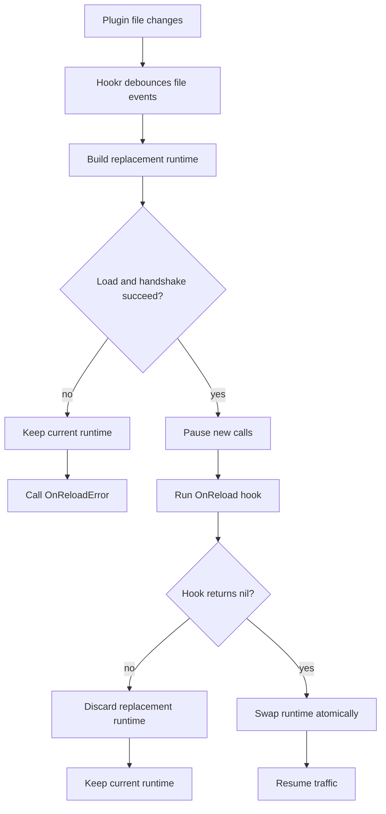

# Enable Live Reload

## Goal

Reload a plugin automatically when its `.wasm` artifact changes on disk, while
keeping the same generated runtime handle in the host application.

Use this for local development loops where the host rebuilds a plugin and wants
Hookr to swap in the replacement runtime on its behalf.

## Before You Start

- build the plugin as a normal Hookr plugin
- open it through the generated contract package
- use an unsigned local artifact or another trust policy that accepts changing
  binaries

Live reload creates a fresh plugin instance. Any state that only exists inside
Wasm memory is lost on reload. If your application needs continuity, keep state
host-side and rehydrate it in `OnReload`.

## Minimal Setup

```go
plugin, err := mycontracthookr.Open(ctx, mycontracthookr.Config{
	PluginPath: "./bin/plugin.wasm",
	FileOptions: []hookr.FileOption{
		hookr.WithAllowUnsigned(),
	},
	Reload: &mycontracthookr.ReloadConfig{
		OnReload: func(ctx context.Context, next *mycontracthookr.Runtime, event hookr.ReloadEvent) error {
			_, err := next.GetInfo(ctx, &mycontracthookr.EmptyT{})
			return err
		},
	},
})
if err != nil {
	return err
}
defer plugin.Close(ctx)
```

That is enough to:

- watch `PluginPath`
- load a replacement runtime on file change
- validate the replacement runtime
- run `OnReload`
- swap only if all of that succeeds

## Reload Lifecycle



## Rehydrate Host-Side State

For stateful hosts, use `OnReload` to push the current serialized plugin state
back into the replacement runtime before traffic resumes:

```go
plugin, err := mycontracthookr.Open(ctx, mycontracthookr.Config{
	PluginPath: "./bin/plugin.wasm",
	FileOptions: []hookr.FileOption{
		hookr.WithAllowUnsigned(),
	},
	Reload: &mycontracthookr.ReloadConfig{
		OnReload: func(ctx context.Context, next *mycontracthookr.Runtime, event hookr.ReloadEvent) error {
			_, err := next.LoadState(ctx, &mycontracthookr.LoadStateRequestT{
				State: savedStateBytes,
			})
			return err
		},
	},
})
```

This is the right pattern when:

- the host owns serialized plugin state
- the plugin can rebuild its internal runtime state from that snapshot
- the host wants to keep the same long-lived runtime handle

## Tune Reload Behavior

Use `Debounce` if your build pipeline writes the plugin file more than once:

```go
Reload: &mycontracthookr.ReloadConfig{
	Debounce: 250 * time.Millisecond,
	OnReload: func(ctx context.Context, next *mycontracthookr.Runtime, event hookr.ReloadEvent) error {
		return nil
	},
}
```

This avoids reloading multiple times for one rebuild.

## Handle Reload Failures

Use `OnReloadError` for logs, metrics, and development feedback:

```go
Reload: &mycontracthookr.ReloadConfig{
	OnReload: func(ctx context.Context, next *mycontracthookr.Runtime, event hookr.ReloadEvent) error {
		return nil
	},
	OnReloadError: func(ctx context.Context, err error) {
		log.Printf("plugin reload failed: %v", err)
	},
}
```

If reload fails:

- Hookr keeps the current runtime active
- the replacement runtime is discarded
- the host keeps using the same generated runtime handle

## Notes

- `OnReload` receives the typed generated runtime, not raw byte buffers
- Hookr blocks new plugin calls while the reload critical section runs
- failed reload does not poison the current runtime
- live reload is primarily a development workflow

## Related

- [How-To: Open And Call A Plugin Runtime](./open-and-call-plugin.md)
- [Explanation: Live Reload Lifecycle](../explanation/live-reload-lifecycle.md)
- [Reference: Generated Go API](../reference/generated-go-api.md)
