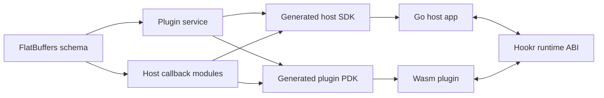

# Hookr Plugin System

This document belongs to the Diataxis Explanation section:
[Explanation Index](./explanation/index.md).

This document defines Hookr as a generic plugin library for Go applications.

Hookr does not define application methods such as `Update`, `Definition`, or
`ValidateUrl`. Those are defined by the project that uses Hookr.

Hookr owns:

- the Wasm plugin ABI,
- the host <-> plugin transport,
- startup contract validation,
- generated host SDK and plugin PDK glue,
- CLI orchestration,
- test and benchmark support.

Hookr does not own:

- the application's plugin methods,
- FlatBuffers schema parsing,
- FlatBuffers wire encoding/decoding,
- language-native FlatBuffers bindings.

## Core Decisions

1. Hookr uses FlatBuffers as the single contract and wire format.
2. Hookr uses existing FlatBuffers tooling, especially `flatc`.
3. Hookr generates glue around official FlatBuffers outputs instead of
   re-implementing FlatBuffers parsing or serialization.
4. Host applications define the plugin API in `.fbs`.
5. Hookr provides one primary runtime path: method-ID dispatch over Wasm.

## Tooling Model

`hookr gen` should orchestrate the existing FlatBuffers toolchain:

1. Accept a user-defined `.fbs` schema.
2. Run `flatc --binary --schema` to produce `.bfbs`.
3. Run `flatc` for target-language bindings such as Go.
4. Read `.bfbs` as Hookr's contract IR.
5. Generate Hookr-specific code on top of the official FlatBuffers outputs.

This keeps FlatBuffers concerns in FlatBuffers tooling and Hookr concerns in
Hookr tooling.

## Contract Shape

Hookr should be opinionated about service layout while remaining generic.

Default convention:

- `Plugin` service: methods the host calls on the plugin
- every other `rpc_service`: a host callback module the plugin can call

Hookr auto-discovers host modules from the schema. The host side gets a
generated aggregate `Host` struct with one field per module, and the plugin
side gets namespaced clients such as `ctx.Rng.Int(...)`.



Plugin methods are required by default. Optional methods should be expressed in
the schema via Hookr-recognized FlatBuffers attributes.

Example:

```fbs
attribute "hookr_optional";

rpc_service Plugin {
  GetInfo(Empty):PluginInfo;
  Warmup(Empty):Empty (hookr_optional);
}
```

Each contract yields:

- a canonical contract hash derived from normalized contract metadata,
- stable method IDs,
- generated host/client wrappers,
- generated plugin registration helpers,
- generated callback helpers.

## ABI Shape

The hot-path ABI should remain method-ID based.

- Host -> plugin: `method_id + req_ptr + req_len`
- Plugin -> host: `method_id + req_ptr + req_len`

The public Go API should hide raw method IDs behind generated code.

## Memory Model

Target behavior:

- zero-copy reads where possible,
- no per-message free,
- one boundary write per direction at most,
- guest linear memory as the transport arena.

True shared-memory zero-copy between host and guest is not the target because
Wasm host and guest do not share arbitrary native pointers.

## Public Go Experience

The generated Go experience should be the default.

Host side:

```go
plugin, err := urlbalancerhookr.Open(ctx, urlbalancerhookr.Config{
	PluginPath: "./plugin.wasm",
	Host: urlbalancerhookr.Host{
		Rng: host{},
	},
})
if err != nil {
	return err
}

resp, err := plugin.Balance(ctx, req)
```

`PluginPath` is the plugin artifact path. A host can swap different `.wasm`
plugins there as long as they implement the same generated contract.

Plugin side:

```go
type Plugin struct{}

func (Plugin) Balance(
	ctx *urlbalancerhookr.PluginContext,
	req urlbalancerhookr.BalanceRequest,
) (urlbalancerhookr.BalanceResponse, error) {
	// plugin logic
}

//go:wasmexport hookr_init
func hookrInit() {
	urlbalancerhookr.MustRegisterPlugin(Plugin{})
}
```

The user should not need to manually:

- assign method IDs,
- register methods by string,
- wire handshakes,
- write serialization code,
- manage transport memory.

The first Go surface should stay ergonomic and should expose the
FlatBuffers-generated Go types directly. Lower-level performance helpers can
exist underneath that API, but the normal path should stay compact.

For a full worked example, see
[`docs/tutorials/urlbalancer.md`](./tutorials/urlbalancer.md).

## First E2E Fixtures

The first consumer-defined contract fixtures should include:

- `urlbalancer`
- `textfilter`
- `tickloop`

These fixtures exist to prove that:

- Hookr supports arbitrary host-defined plugin APIs,
- structured inputs/outputs work,
- host callbacks work,
- the generated host/plugin experience is small and clear,
- the system is credible for both tutorial-style flows and tight-loop
  benchmark-style flows.

`urlbalancer` should include:

- plugin method `GetInfo`
- plugin method `Balance`
- host module `Rng`
- callback methods `Int` and `Float`

The plugin receives a request with a URL and a list of backend nodes, validates
the URL, calls host RNG helpers, and selects a node to route to.

`textfilter` should be the smallest no-callback tutorial example.

`tickloop` should be the benchmark-oriented hot-loop example.

## Current Status And Next Steps

The Go-first delivery plan described above is implemented:

- Hookr generates Go SDK/PDK glue from `.fbs` through `flatc`
- Hookr builds standard Go `wasip1/wasm` plugins
- Hookr has first-party `urlbalancer`, `textfilter`, and `tickloop` fixtures
- Hookr supports inspect/call/TUI developer workflows
- Hookr has benchmark fixtures and published benchmark snapshots

The next phases are no longer about proving the core model. They are about:

1. expanding the benchmark matrix,
2. piloting the system in a real consumer application,
3. preparing future Rust and Zig backends without changing the Go-first API.
